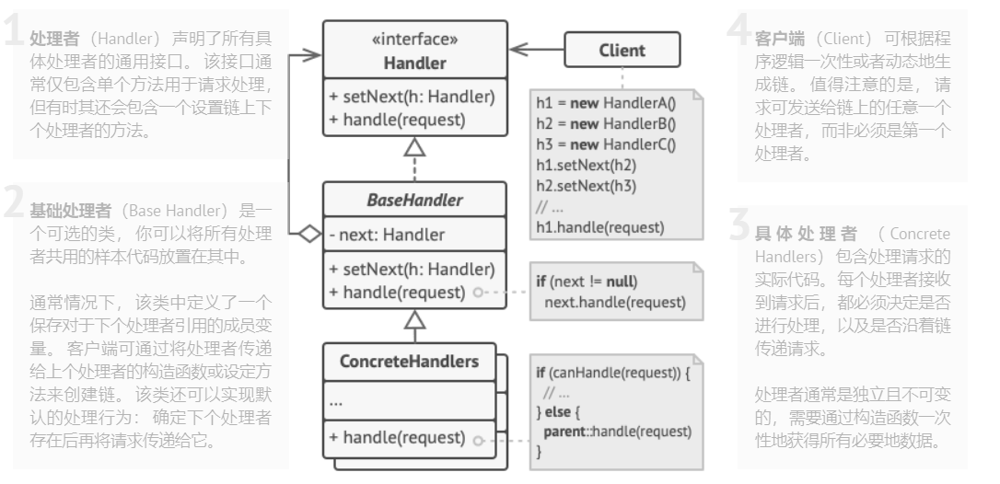

## 责任链模式
责任链模式是一种行为设计模式， 允许你将请求沿着处理者链进行发送。 收到请求后， 每个处理者均可对请求进行处理， 或将其传递给链上的下个处理者。

### 适用场景
##### 当程序需要使用不同方式处理不同种类请求， 而且请求类型和顺序预先未知时， 可以使用责任链模式。

该模式能将多个处理者连接成一条链。 接收到请求后， 它会 “询问” 每个处理者是否能够对其进行处理。 这样所有处理者都有机会来处理请求。

##### 当必须按顺序执行多个处理者时， 可以使用该模式。

无论你以何种顺序将处理者连接成一条链， 所有请求都会严格按照顺序通过链上的处理者。

##### 如果所需处理者及其顺序必须在运行时进行改变， 可以使用责任链模式。

如果在处理者类中有对引用成员变量的设定方法， 你将能动态地插入和移除处理者， 或者改变其顺序。

[返回大纲](../../README.MD) 